# Advent of Code 2024!!

⚠ To execute my solution(s) of any 2024 puzzle on Linux, replace all instances of ``\r\n`` by ``\n`` in all usages of the ``strings.Split`` function.

In a terminal located in the main folder, execute

```bash
go run 2024/dayXX/partX.go
```

obviously replacing ``XX`` with the day number (any day below ten is referenced as ``0X``) and ``X`` by either ``1`` or ``2``.

Note: optimized versions of my solution for the following puzzles can be found as ``../partX_optimized.go`` files:
- 2024 day 5, part 2
- 2024 day 6, part 2
- 2024 day 7, part 1
- 2024 day 20, part 1

 These versions constitute a different enough approach to the initial solving method, which makes it so that keeping both versions is relevant. Changes can be found at the top of the optimized file.
 
## Click on the tiles to get to my code!
<!-- AOC TILES BEGIN -->
<h1 align="center">
  2024 - 48 ⭐ - Go
</h1>
<a href="2024/day01/part1.go">
  
</a>
<a href="2024/day02/part1.go">
  
</a>
<a href="2024/day03/part1.go">
  
</a>
<a href="2024/day04/part1.go">
  
</a>
<a href="2024/day05/part1.go">
  
</a>
<a href="2024/day06/part1.go">
  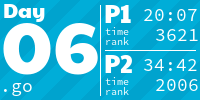
</a>
<a href="2024/day07/part1.go">
  
</a>
<a href="2024/day08/part1.go">
  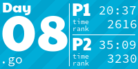
</a>
<a href="2024/day09/part1.go">
  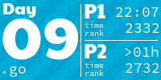
</a>
<a href="2024/day10/part1.go">
  
</a>
<a href="2024/day11/part1.go">
  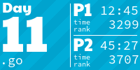
</a>
<a href="2024/day12/part1.go">
  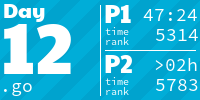
</a>
<a href="2024/day13/part1.go">
  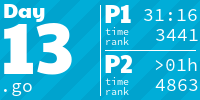
</a>
<a href="2024/day14/part1.go">
  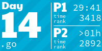
</a>
<a href="2024/day15/part1.go">
  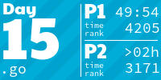
</a>
<a href="2024/day16/part1.go">
  
</a>
<a href="2024/day17/part1.go">
  
</a>
<a href="2024/day18/part1.go">
  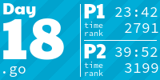
</a>
<a href="2024/day19/part1.go">
  
</a>
<a href="2024/day20/part1.go">
  
</a>
<a href="2024/day21/part1.go">
  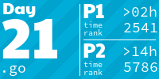
</a>
<a href="2024/day22/part1.go">
  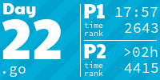
</a>
<a href="2024/day23/part1.go">
  
</a>
<a href="2024/day24/part1.go">
  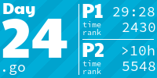
</a>
<a href="2024/day25/part1.go">
  
</a>
<h1 align="center">
  2023 - 11 ⭐ - Go
</h1>
<a href="2023/day01/part1.go">
  
</a>
<a href="2023/day02/part1.go">
  
</a>
<a href="2023/day03/part1.go">
  
</a>
<a href="2023/day04/part1.go">
  
</a>
<a href="2023/day05/part1.go">
  
</a>
<a href="None">
  
</a>
<a href="None">
  
</a>
<a href="None">
  
</a>
<a href="None">
  
</a>
<a href="None">
  
</a>
<a href="None">
  
</a>
<a href="None">
  
</a>
<a href="None">
  
</a>
<a href="None">
  
</a>
<a href="None">
  
</a>
<a href="2023/day16/part1.go">
  
</a>
<a href="None">
  
</a>
<a href="None">
  
</a>
<a href="None">
  
</a>
<a href="None">
  
</a>
<a href="None">
  
</a>
<a href="None">
  
</a>
<a href="None">
  
</a>
<a href="None">
  
</a>
<a href="None">
  
</a>
<!-- AOC TILES END --> 

### “Inaccurate” 2024 times (days when I started solving the puzzle after 6)
- <u>day 1</u>: *Anim’Est* made it so that I couldn’t easily do the day earlier
- <u>day 2</u>: Post-*Anim’Est* sleep (+ I hadn’t made the decision to start grinding)
- <u>day 3</u>: Started at **6:25** (hadn’t fully commited yet)
- <u>day 15</u>: Started at **6:16** (alarm somehow didn’t go off)

